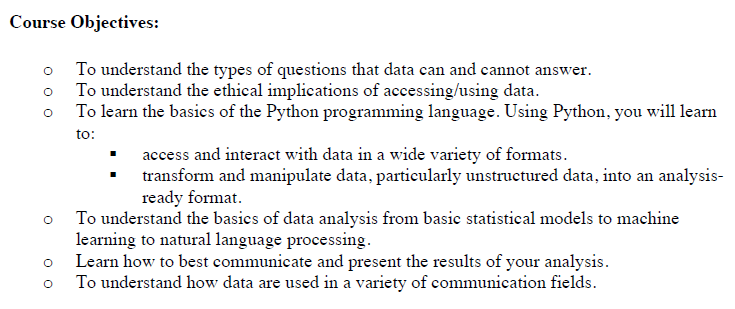
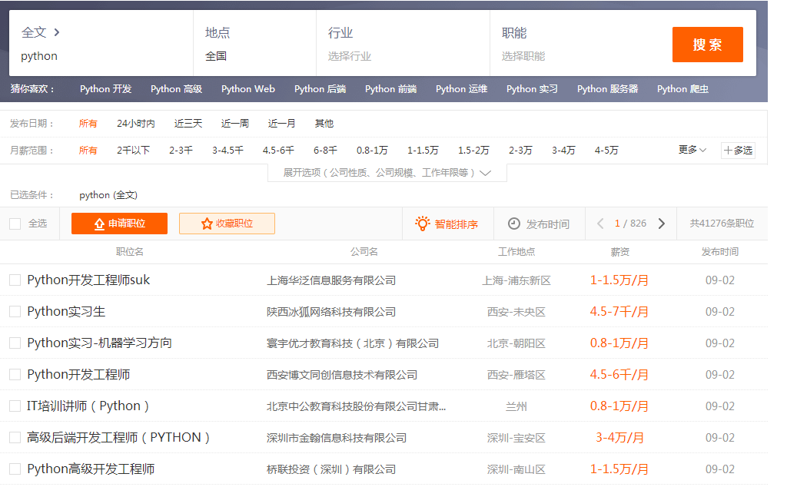
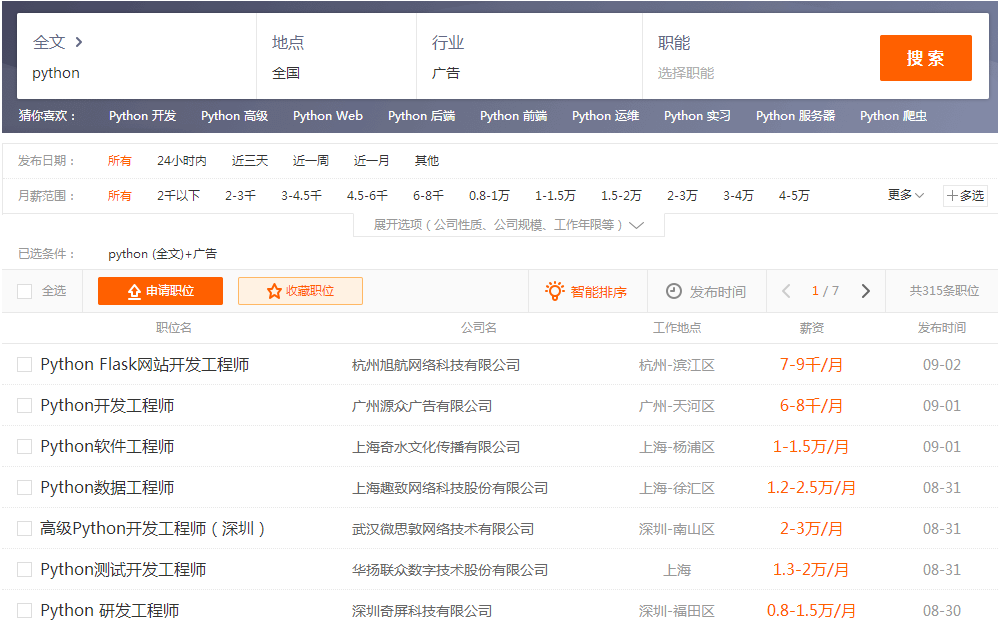
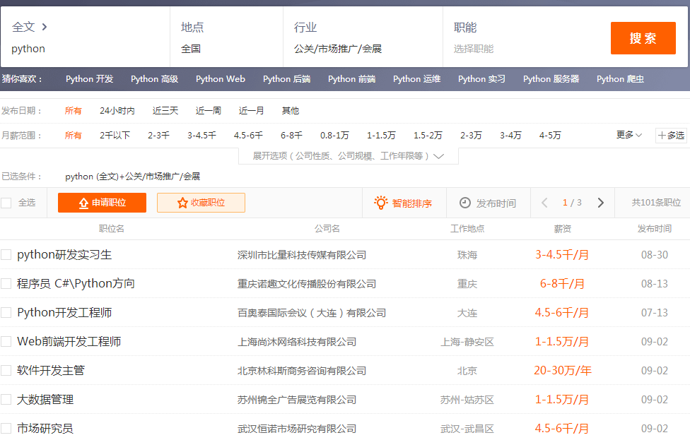
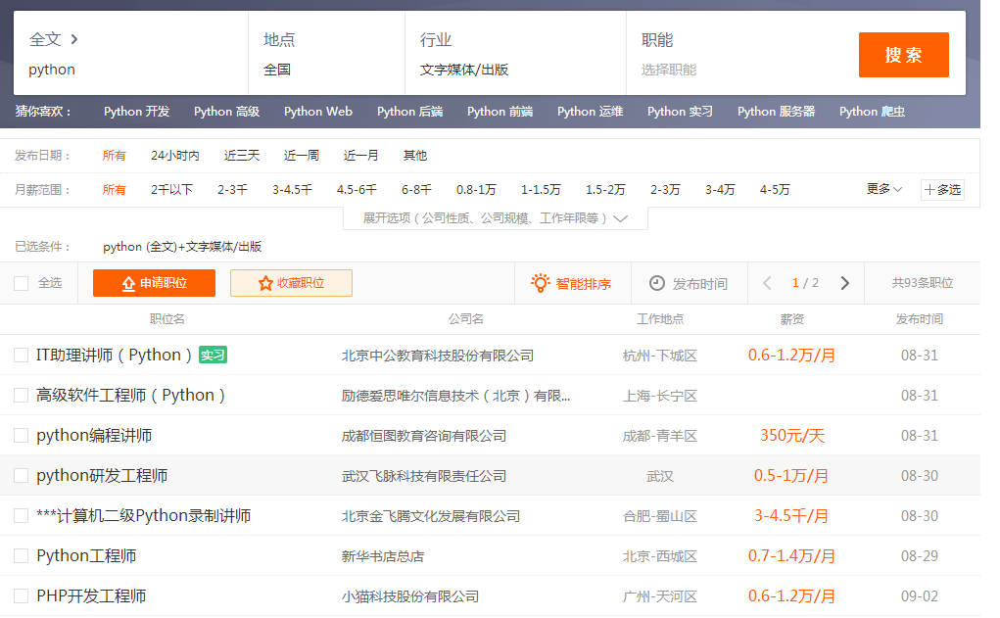
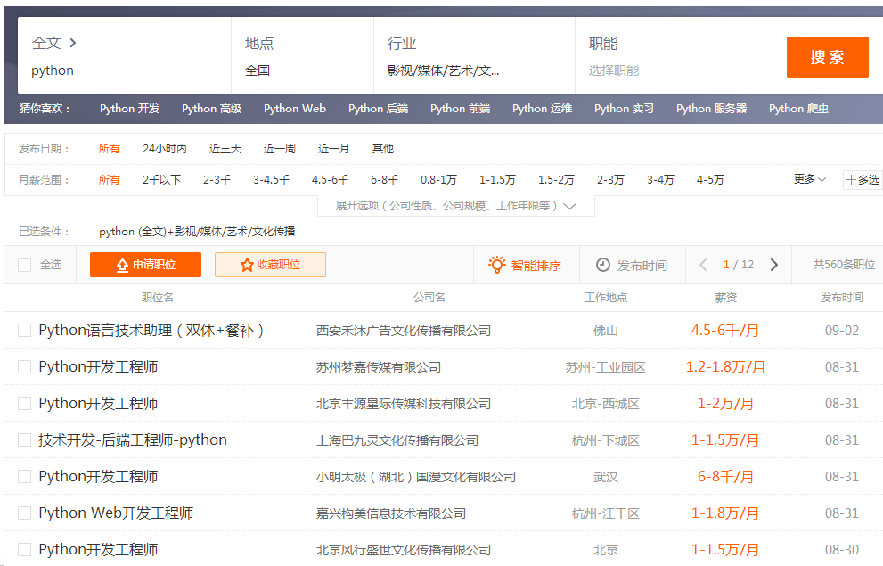
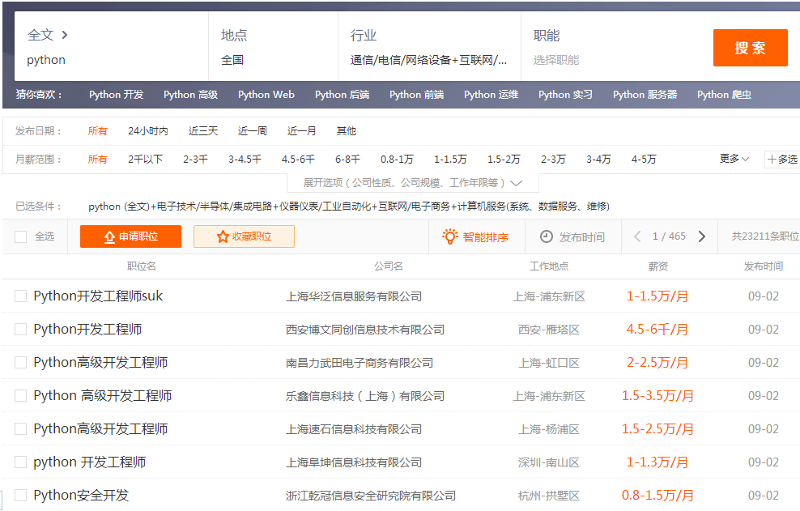

# Python in school
### Abroad
1. British

In September 2014, the British government announced that computer programming courses became one of the compulsory courses for students over 5 years old.
2. Amercia

 In 2016, Obama suggested that in the next few years, the US government should provide computer and mathematics courses to each K-12 (Compulsory Education) student to prepare them for future work.
3.  Japan

In 2017, the government of Japan announced that programming will begin as a compulsory course for elementary schools starting in 2020.

### Domestic
1. In December 2017, the latest sixth-grade elementary school information technology textbook in Shandong, China, also added Python content.

2. In March 2018, Python joined the National Computer Level 2 exam, which will be launched for the first time in September 2018.

3. In the future, Python may become one of the college entrance examination related subjects in China.

---
Recently, Python has become more and more popular in China, but The C Programming Language has become a compulsory course for most computer students at present. Less universities in mainland China have provided python courses for the following reasons:

-  The C Programming Language is regarded as a foundation of computer programming language, after learning that, it will be more acceptable to access other programming language.
-  Although Python is easy to read and easy to write, for students who are computer majors, just learning Python is not enough.

So, for non-computer majors, how popular is the python course?

I have collected the information from coummunication school of 32 universities and the way I used was to browse those universities' official website, then searched the keyword "python".
And I found that there are 21 universities have offer the python courses available.

University | python course | University | python course
---|---|---|---
Hong Kong Baptist University| Yes |Western Michigan University | Yes
Denver University | Yes|Regent University | Yes
Northwestern University | Yes |Doon University | Yes
University of North Carolina at Chapel Hill | Yes |Marist College | Yes
Pennsylvania University | Yes |Chapman University | Yes
American University | Yes |Royal College of Art | No
University of Southern California | Yes |Simon Fraser University | No
Loyola University Chicago | Yes |The Ohio State University | No
Boston University| Yes |University of Miami | No
University of Houston | Yes |University of Leeds | No
University of Central Florida| Yes |Rutgers University | No
Bellarmine University| Yes |Florida State University | No
Falmouth University | Yes |Taylor's University | No
University of Hawaii's  | Yes |Daystar University | No
Rutgers University| Yes |Dublin City University | No
Cleveland State University | Yes |The Lagos State University | No

According to my simple survey, we can found that nearly 65% universities provided python education to students in both computer and non-computer majors.

Take the University of North Carolina at Chapel Hill (UNC) as an example.
The School of Journalism & Mass Communication of UNC offers a course "Digital Data & Analytics". This course uses the Python programming language to develop students' skills to acquire and analyze data.Below is information about the course objectives: 

In conclusion, the popularity of python in foreign universities is higher than in China.

---

# Python in industry

Comparing to other languages,Python's growth rate of job demand has reached 174% in 2017. When we open the recruitment website and enter the key word "python" to search for related positions, we can find that there are over 40,000 job requirements in mainland Chinathe and the salary of this job is about 10,000 or more.

 
##  Python popular in communication industry
Whether it is a new media company or a traditional media company, it is showing rising demand for a person with IT ability. In the era of big data, knowing how to use Python to mine data content has become a practitioner's advantage.

Therefore, the python is also popular in communication industry.

- ##  Adversiting
There are approximately 315 jobs in the advertising industry to recruit python positions.

- ##  Public relations/Marketing /Exhibition

About 101 jobs in the Public relations/Marketing /Exhibition
 industry to recruit python positions.
 

- ##  Text media
93 positions are available

- ##  Film/Media/Art/Culture Communication
There are approximately 560 jobs in the advertising industry to recruit python positions.

- ##  Computer / Internet / Communication / Electronics

There are nearly 24,000 jobs in the computer information technology industry!

In conclusion, There are only about one thousand python jobs in the communication industry, but the computer industry has more than 20,000 positions of python, which accounts for half of all python jobs. Despite in the communication industry, the demand for python talent will be increased in the future, but python is currently popular in the computer field.

